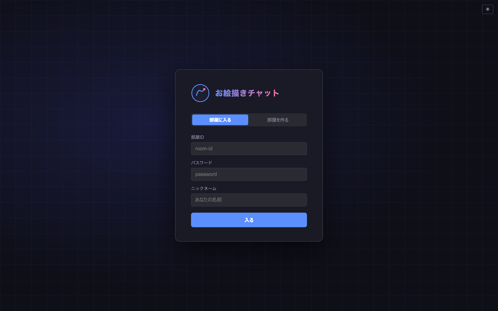

# お絵描きチャット Neo

リアルタイム多人数同時お絵描きチャットアプリケーション。  
CLIP STUDIO PAINT / FireAlpaca ライクな本格ペイント UI を備え、複数ユーザーが同じキャンバスに同時に描画できます。

---

## スクリーンショット

### ルーム画面



### メイン描画画面


---

## 機能

### お絵描き

| 機能 | 詳細 |
|------|------|
| **ブラシエンジン** | C++17 製カスタムエンジンを WebAssembly でコンパイル。TS フォールバック自動切り替え |
| **ブラシ 9 種** | ペン / マーカー / 鉛筆 / クレヨン / エアブラシ / 水彩 / 油彩 / パステル / ぼかし |
| **筆圧対応** | Pointer Events API により、対応デバイスで筆圧を検出 |
| **消しゴム** | Porter-Duff α合成で正確に消去 |
| **塗りつぶし** | スキャンライン FloodFill、許容値で精度調整 |
| **選択ツール** | 矩形選択 / 自由（ラッソ）選択。選択後に変形モードへ移行可能 |
| **選択変形** | 選択範囲を 8 方向リサイズ＋回転ハンドルで自由変形。Shift で 15° スナップ |
| **貼り付け変形** | 貼り付け時に自動で変形モードへ移行。位置・サイズ・角度を決めてから確定 |
| **クリップボード** | 切り取り / コピー / 貼り付け |
| **手のひらツール** | ドラッグ中のみパン（Space ホールドでも一時切り替え） |
| **スポイト** | キャンバスから色取得。Alt+クリックでも起動 |
| **全リセット** | キャンバスを白紙に戻す |

### カラー

| 機能 | 詳細 |
|------|------|
| **色相環** | Canvas 描画の HSV カラーホイール（リング + SV 内接正方形） |
| **入力フォーム** | RGB (0–255) / HSL (度・%) / カラーコード (#RRGGBB) 相互同期 |
| **パレット** | 10 色クイックパレット |

### ブラシパラメータ

| パラメータ | 範囲 | 備考 |
|-----------|------|------|
| サイズ | 1 – 500 px | |
| 不透明度 | 0 – 100 % | |
| 濃度 | 0 – 100 % | 1 ダブあたりの不透明度への寄与率 |
| 間隔 | 1 – 200 % | ダブの描画間隔（ブラシサイズ比） |
| 硬さ | 0 – 100 % | エッジのシャープさ |
| 混色 | 0 – 100 % | **水彩 / 油彩専用** |
| 水分量 | 0 – 100 % | **水彩 / 油彩専用** |
| 色伸び | 0 – 100 % | **水彩 / 油彩専用** |

各パラメータには **筆圧カーブ / 速度カーブ / ランダム量** を個別に設定できます（各カーブはアコーディオンで折りたたみ可能）。  
ブラシの設定はブラシ種類ごとに **Cookie** へ自動保存され、ページ再読み込み後も維持されます。

### マルチユーザー

| 機能 | 詳細 |
|------|------|
| **部屋作成** | 任意のID（英数字 32 文字以内）とパスワードで部屋を作成 |
| **認証** | bcrypt でパスワードをハッシュ化、Socket.IO で入室認証 |
| **最大人数** | 1 部屋あたり 5 人まで |
| **リアルタイム同期** | ストローク・塗りつぶし・貼り付けを他ユーザーにリアルタイム配信 |
| **カーソル共有** | 他ユーザーのカーソル位置をキャンバス上に表示 |
| **テキストチャット** | 部屋内チャット（500 文字以内） |

### 部屋のライフサイクル

部屋はサーバーのメモリ上にのみ存在します（データベースへの永続化はありません）。

| フェーズ | タイミング | 内容 |
|----------|-----------|------|
| **作成** | `POST /api/rooms` | パスワードを bcrypt でハッシュ化して登録 |
| **入室** | Socket `join_room` | パスワード照合 → 成功すればキャンバス状態を新規参加者に送信 |
| **キャンバス同期** | クライアントが 30 秒ごとに送信 | サーバーは最新の状態を 1 枚だけ保持 |
| **退出** | Socket 切断時 | 参加者リストから除外、他ユーザーへ通知 |
| **削除** | 最後の 1 人が退出してから **30 分後** | 誰も戻らなければ部屋とキャンバス状態を削除 |
| **全消滅** | サーバー再起動時 | 全部屋・全キャンバス状態が失われる |

> **注意**: 部屋が削除されると描いた内容も失われます。大切な絵は「ファイル → PNG で保存」で手元に残してください。

---

## ショートカット

### 編集

| 操作 | ショートカット |
|------|--------------|
| 元に戻す | `Ctrl+Z` |
| やり直す | `Ctrl+Y` |
| コピー | `Ctrl+C` |
| 切り取り | `Ctrl+X` |
| 貼り付け（変形モード） | `Ctrl+V` |
| すべて選択 | `Ctrl+A` |
| 選択解除 | `Ctrl+D` |
| 変形モードへ移行 | `Ctrl+T` |
| 変形を確定 | `Enter` |
| 変形をキャンセル | `Escape` |
| PNG 保存 | `Ctrl+S` |

### ツール

| キー | ツール |
|------|--------|
| `B` | ブラシ |
| `E` | 消しゴム |
| `G` | 塗りつぶし |
| `H` | 手のひら |
| `M` | 矩形選択 |
| `L` | 自由選択 |
| `I` | スポイト |
| `Space` (ホールド) | 手のひら（一時切り替え）|
| `[` / `]` | ブラシサイズ 2px 縮小 / 拡大 |
| `P` | 右パネル 折りたたみ / 展開 |

### ズーム

| 操作 | 動作 |
|------|------|
| マウスホイール（縦） | カーソル位置を中心にズームイン / アウト |
| トラックパッド（横スクロール） | 水平パン |
| ステータスバーの倍率表示をクリック | プリセット一覧（25〜400%）またはカスタム値 |
| `+` / `-` | ズームイン / アウト |
| `0` | ズームリセット (100%) |

### 変形ハンドル操作

変形モード（選択変形・貼り付け変形）では以下の操作が使えます。

| 操作 | 動作 |
|------|------|
| 四隅・辺のハンドルをドラッグ | リサイズ |
| 上部の回転ハンドルをドラッグ | 回転 |
| `Shift` + 回転ドラッグ | 15° 単位でスナップ回転 |
| 変形枠内をドラッグ | 移動 |
| 変形枠外をクリック | 変形を確定して選択解除 |

---

## 表示設定

- メニューバー右端（または部屋入室前の画面右上）の **☀ / 🌙** ボタンでライト / ダークを切り替え  
  設定は `localStorage` に保存され、次回起動時も維持される
- 右パネル右端の **◀ / ▶** ボタン（または `P` キー）でカラー・ブラシパネルを折りたたみ可能  
  折りたたみ状態は Cookie に保存される

---

## 保存

- **PNG** / **JPEG** でキャンバスをダウンロード（メニュー → ファイル または `Ctrl+S`）

---

## アーキテクチャ

```
                  ┌──────────────────┐
  ブラウザ        │   nginx :80       │
  ──────────────▶│  静的ファイル配信  │
                  │  /api, /socket.io │
                  │  → proxy          │
                  └────────┬─────────┘
                           │
                  ┌────────▼─────────┐
                  │  Node.js :3001    │
                  │  Express          │
                  │  Socket.IO        │
                  │  bcryptjs         │
                  │  (in-memory store)│
                  └──────────────────┘

  フロントエンド内部
  ┌──────────────────────────────────────────────────┐
  │  app.ts (メインコントローラー)                    │
  │  ┌──────────────┐  ┌───────────────────────────┐ │
  │  │CanvasEngine  │  │SocketClient               │ │
  │  │ zoom/pan     │  │ join_room                 │ │
  │  │ undo/redo    │  │ draw_op 送受信             │ │
  │  │ export       │  │ cursor_move               │ │
  │  └──────┬───────┘  └───────────────────────────┘ │
  │  ┌──────▼───────┐  ┌───────────────────────────┐ │
  │  │ToolManager   │  │ColorPicker                │ │
  │  │ WasmBrush ─┐ │  │BrushPanel + BrushStorage  │ │
  │  │  └ TSfallbk │  │CurveEditor                │ │
  │  │ FloodFill   │  │RoomUI                     │ │
  │  │ SelectionMgr│  └───────────────────────────┘ │
  │  │  transform  │                                 │
  │  └──────────────┘                                │
  └──────────────────────────────────────────────────┘
```

### ブラシエンジン

独自実装の C++17 ブラシエンジンを Emscripten で WebAssembly にコンパイルしています。

| 技術 | 詳細 |
|------|------|
| **N×N サブピクセル過剰サンプリング** | 小径ブラシ N=11、中径 N=5、大径 N=3。エッジの滑らかさを保証 |
| **2ゾーンハードネス** | 内円（全不透明）＋外縁（cubic smoothstep）の独自式。硬さ 0 で中心から滑らかなグラデーション、1 で完全な円 |
| **ストローク開始スナップショット** | ストローク開始時のキャンバスを `preStroke_` に複製。湿式ブラシの色混合はスナップショットから読み取り、ダブ重複による色ムラを防ぐ |
| **最大アルファ合成** | `alphaBuf_` でダブ重複箇所のアルファを上限管理。スナップショットへの再合成で同一ストローク内の不自然な色蓄積を防ぐ |
| **ダーティ矩形フラッシュ** | `strokeTo` のたびに変化した矩形領域のみ Canvas に書き戻す（フルキャンバスコピー不要） |
| **TS フォールバック** | Wasm 未ロード時は同アルゴリズムの TypeScript 実装で動作 |

**Wasm のビルド方法:**

```bash
cd brushwasm
make          # frontend/public/brush_engine.js + .wasm を生成
```

Emscripten (`em++`) が必要です。

---

## 動作要件

| 項目 | 条件 |
|------|------|
| Docker | 24 以上推奨 |
| Docker Compose | v2 以上 |
| ブラウザ | Chrome / Edge / Firefox / Safari 最新版 |

ローカル開発のみ行う場合:
- Node.js 20 以上
- Emscripten（Wasm ビルドを行う場合のみ）

---

## セットアップ

### Docker で起動（推奨）

```bash
# リポジトリをクローン
git clone <repository-url>
cd oekaki-chat-neo

# ビルドして起動
docker-compose up --build

# バックグラウンドで起動
docker-compose up --build -d
```

ブラウザで `http://localhost` を開く。

> Wasm ビルドが失敗しても TypeScript エンジンにフォールバックし、アプリは正常に動作します。

### ローカル開発（Docker なし）

```bash
# Wasm ブラシエンジンをビルド（Emscripten インストール済みの場合）
cd brushwasm
make

# バックエンド
cd backend
npm install
node src/server.js
# → http://localhost:3001

# フロントエンド（別ターミナル）
cd frontend
npm install
npm run dev
# → http://localhost:5173
```

Vite の dev proxy が `/api` と `/socket.io` を自動的にバックエンドへ転送します。

---

## 使い方

### 1. 部屋を作る

1. アプリを開くとルーム画面が表示される
2. **「部屋を作る」** タブを選択
3. 部屋 ID（例: `my-room`）とパスワード、ニックネームを入力
4. **「作成して入る」** をクリック

### 2. 部屋に入る

1. **「部屋に入る」** タブを選択
2. 部屋 ID・パスワード・ニックネームを入力して **「入る」** をクリック

> 部屋は最大 5 人まで参加可能。満員の場合はエラーメッセージが表示されます。

### 3. 描く

- 左ツールバーでツールを選択（またはショートカットキー）
- 右パネルの **カラー** セクションで色を選択
- 右パネルの **ブラシ** セクションでブラシ種類・パラメータを調整
- キャンバスに描画
- 他のユーザーの描画がリアルタイムで同期される

### 4. 選択範囲を変形する

1. `M`（矩形選択）または `L`（自由選択）で範囲を指定
2. ステータスバー上の選択バーから **「変形」** をクリック（または `Ctrl+T`）
3. ハンドルをドラッグしてリサイズ・回転
4. **「確定」** をクリック（または `Enter`）でキャンバスに合成

### 5. 保存する

- メニュー **ファイル → PNG で保存** または `Ctrl+S`
- JPEG で保存する場合は **ファイル → JPEG で保存**

---

## ディレクトリ構成

```
oekaki-chat-neo/
├── docker-compose.yml
├── .gitignore
├── .gitattributes
├── README.md
│
├── backend/                      # Node.js サーバー
│   ├── Dockerfile
│   ├── package.json
│   └── src/
│       └── server.js             # Express + Socket.IO + 部屋管理
│
├── brushwasm/                    # C++17 ブラシエンジン (Wasm)
│   ├── Makefile                  # em++ でビルド → frontend/public/ へ出力
│   └── src/
│       ├── brush_engine.h        # エンジン API・構造体定義
│       ├── brush_engine.cpp      # 全ブラシアルゴリズム実装
│       └── wasm_exports.cpp      # Emscripten エクスポート関数
│
└── frontend/                     # Vite + TypeScript
    ├── Dockerfile
    ├── nginx.conf
    ├── package.json
    ├── tsconfig.json
    ├── vite.config.ts
    ├── index.html
    ├── public/
    │   ├── favicon.svg           # ブラウザタブアイコン
    │   ├── favicon-32.png        # SVG 非対応ブラウザ向けフォールバック
    │   ├── apple-touch-icon.png  # iOS ホーム画面アイコン (180×180)
    │   ├── brush_engine.js       # Emscripten 生成ローダー
    │   └── brush_engine.wasm     # コンパイル済み Wasm バイナリ
    └── src/
        ├── main.ts               # エントリポイント
        ├── app.ts                # メインコントローラー
        ├── types.ts              # 型定義
        ├── canvas/
        │   ├── BrushEngine.ts    # TS ブラシエンジン（Wasm フォールバック）
        │   ├── WasmBrushEngine.ts# Wasm ラッパー・エンジン選択
        │   ├── CanvasEngine.ts   # zoom・pan・undo・export
        │   ├── FloodFill.ts      # スキャンライン塗りつぶし
        │   ├── Selection.ts      # 矩形/ラッソ選択・変形・クリップボード
        │   └── Tools.ts          # 全ツール実装
        ├── ui/
        │   ├── ColorPicker.ts    # HSV 色相環 + 入力フォーム
        │   ├── BrushPanel.ts     # ブラシ設定 UI
        │   ├── BrushStorage.ts   # ブラシ設定の Cookie 永続化
        │   ├── CurveEditor.ts    # 筆圧/速度カーブエディター
        │   └── RoomUI.ts         # 部屋作成/入室フォーム
        ├── network/
        │   └── SocketClient.ts   # Socket.IO クライアント
        └── styles/
            └── main.css          # ライト/ダーク テーマ対応 CSS
```

---

## Socket.IO イベント一覧

| イベント | 方向 | 説明 |
|---------|------|------|
| `join_room` | C → S | 部屋入室リクエスト |
| `room_joined` | S → C | 入室成功、ユーザー一覧とキャンバス状態を返す |
| `room_error` | S → C | 入室失敗（満員・認証エラーなど） |
| `user_joined` | S → C | 他ユーザーの入室通知 |
| `user_left` | S → C | 他ユーザーの退室通知 |
| `draw_op` | C ↔ S ↔ C | 描画操作（stroke / fill / clear / paste） |
| `canvas_state` | C → S | キャンバス全体の PNG データ（定期同期） |
| `cursor_move` | C ↔ S ↔ C | カーソル位置の共有 |
| `chat_message` | C ↔ S ↔ C | テキストチャット |

---

## 技術スタック

| 分類 | 技術 |
|------|------|
| バックエンド | Node.js, Express, Socket.IO v4, bcryptjs |
| フロントエンド | TypeScript, Vite, Canvas 2D API |
| ブラシエンジン | C++17 (WebAssembly / Emscripten)、TypeScript フォールバック |
| インフラ | Docker, Docker Compose, nginx |
| 描画同期 | Socket.IO WebSocket |

---

## ライセンス

MIT License
