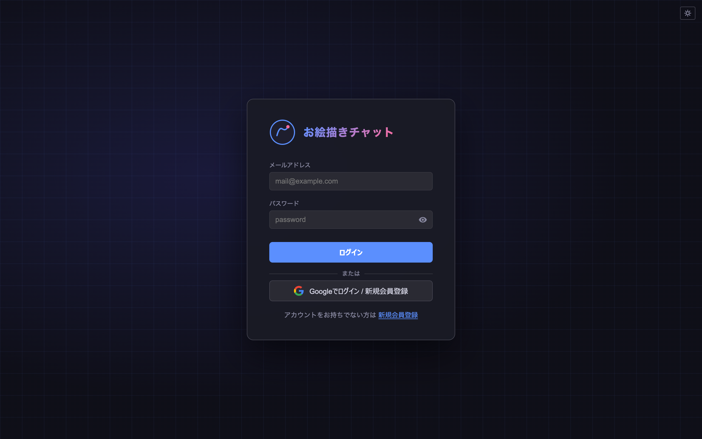
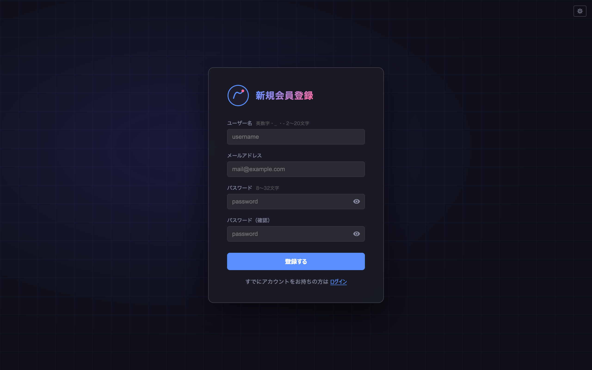
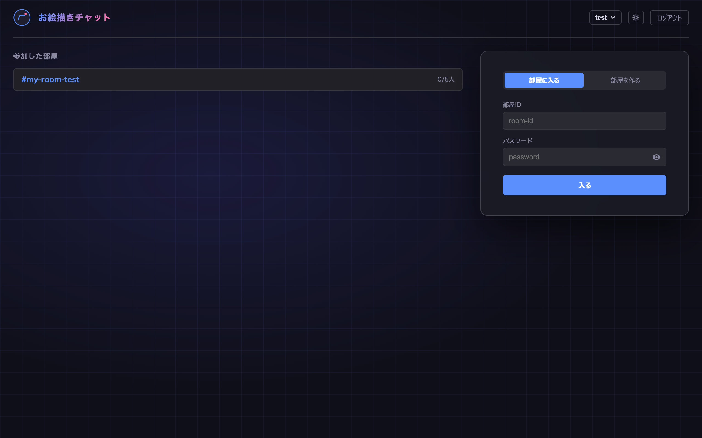
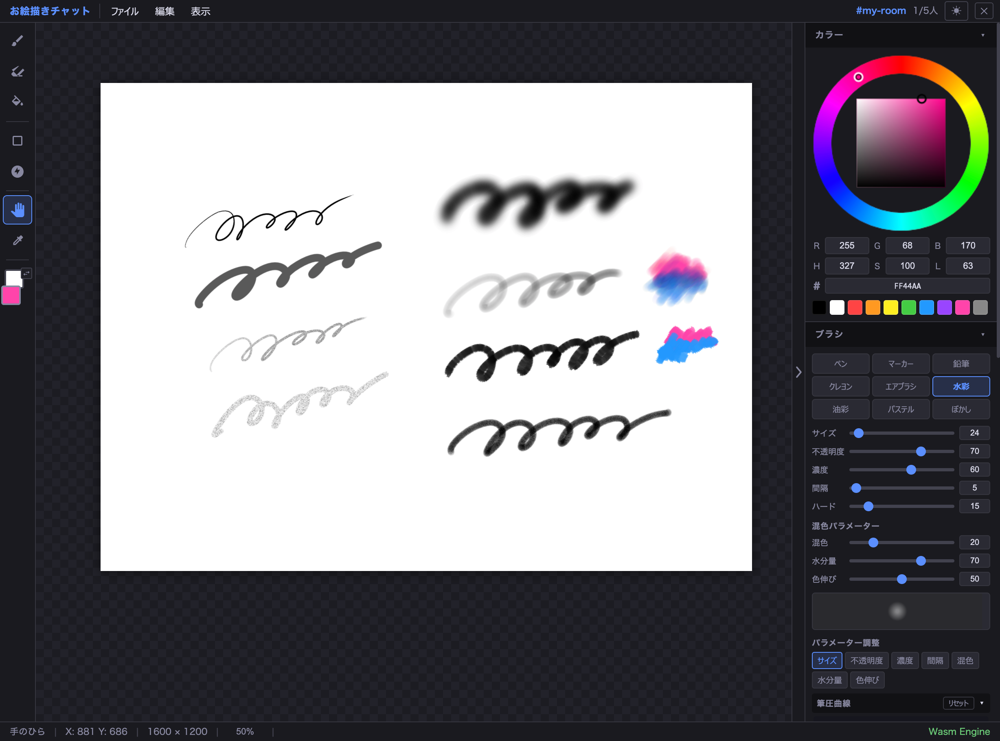
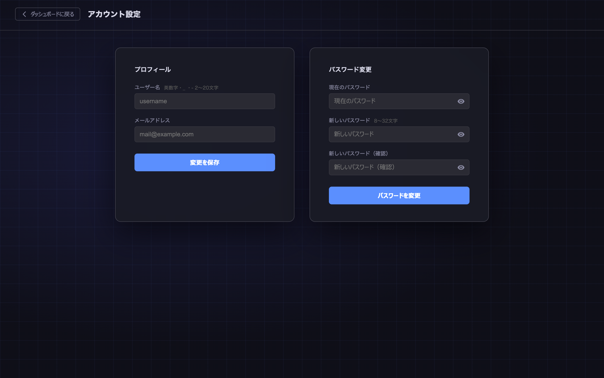
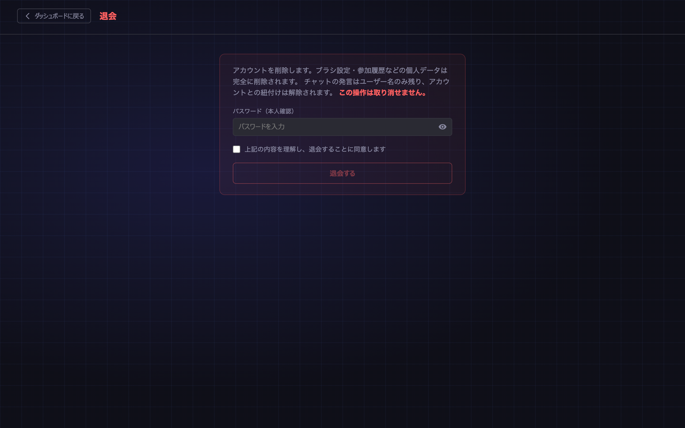
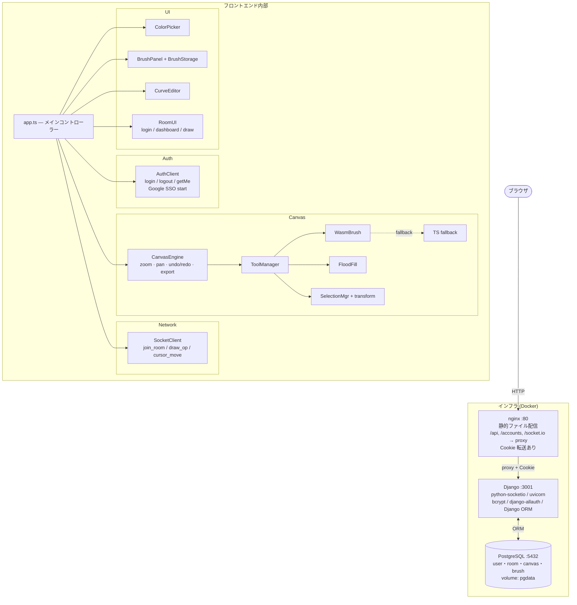

# お絵描きチャット Neo

リアルタイム多人数同時お絵描きチャットアプリケーション。  
ネイティブのペイントソフトライクな本格ペイント UI を備え、複数ユーザーが同じキャンバスに同時に描画できます。

---

## スクリーンショット

### ログイン画面

メールアドレス＋パスワード、または Google アカウントでログインできます。



### 新規会員登録画面

ユーザー名・メールアドレス・パスワードを入力して登録します。登録直後に自動ログインされます。



### ダッシュボード

ログイン後のトップ画面。過去に参加した部屋の一覧から素早く再入室でき、新しい部屋の作成・入室フォームも右側に表示されます。



### メイン描画画面

左ツールバー・上部メニューバー・右カラー&ブラシパネルで構成されるペイントUIです。ブラシエンジン（Wasm）の種類・パラメータをリアルタイムで調整しながら描画できます。



### アカウント設定画面

ヘッダーのユーザーメニューから遷移。プロフィール（ユーザー名・メールアドレス）の変更とパスワード変更を行えます。



### 退会画面

アカウントの削除確認画面。パスワード入力と同意チェックボックスにより、誤操作を防ぎます。



---

## 機能

### 認証

| 機能 | 詳細 |
|------|------|
| **メールアドレス＋パスワードで新規会員登録** | ユーザー名・メールアドレス・パスワードで登録。登録直後に自動ログイン |
| **メールアドレス＋パスワードでログイン** | 登録済みアカウントでログイン |
| **Google アカウントでログイン / 新規会員登録** | Google SSO（django-allauth）でワンクリック登録＆ログイン |
| **ダッシュボード** | ログイン後に過去参加した部屋の一覧を表示。カードをクリックすると部屋IDが自動入力される。ヘッダーのユーザー名メニューから各設定画面へ遷移できる |
| **アカウント設定** | ヘッダードロップダウンから専用画面へ遷移。ユーザー名・メールアドレス変更とパスワード変更が可能 |
| **退会** | ヘッダードロップダウンから専用画面へ遷移。確認チェック＋パスワード入力（Google SSO 専用アカウントはパスワード不要）で即時削除 |

> **注意**: Google SSO を利用するには `.env` に `GOOGLE_CLIENT_ID` / `GOOGLE_CLIENT_SECRET` の設定が必要です。設定方法は [Google SSO の設定](#google-sso-の設定) を参照してください。

> **⚠️ TODO（セキュリティ）**: メールアドレス＋パスワードでの新規会員登録は、現在メール認証なしで即座にアカウントが作成されます。存在しないアドレスや他人のアドレスで登録できてしまうため、本番運用前にメール認証（登録確認メールの送信）を実装してください。詳細は [TODO / 今後の予定](#todo--今後の予定) を参照。

### お絵描き

| 機能 | 詳細 |
|------|------|
| **ブラシエンジン** | C++17 製カスタムエンジンを WebAssembly でコンパイル。TS フォールバック自動切り替え |
| **ブラシ 9 種** | ペン / マーカー / 鉛筆 / クレヨン / エアブラシ / 水彩 / 油彩 / パステル / ぼかし |
| **筆圧対応** | Pointer Events API により、対応デバイスで筆圧を検出 |
| **消しゴム** | Porter-Duff α合成で正確に消去 |
| **塗りつぶし** | スキャンライン FloodFill、許容値で精度調整 |
| **選択ツール** | 矩形選択 / 自由（ラッソ）選択。選択後に変形モードへ移行可能 |
| **選択変形** | 選択範囲を 8 方向リサイズ＋回転ハンドルで自由変形。Shift で 15° スナップ |
| **貼り付け変形** | 貼り付け時に自動で変形モードへ移行。位置・サイズ・角度を決めてから確定 |
| **クリップボード** | 切り取り / コピー / 貼り付け |
| **手のひらツール** | ドラッグ中のみパン（Space ホールドでも一時切り替え） |
| **スポイト** | キャンバスから色取得。Alt+クリックでも起動 |
| **全リセット** | キャンバスを白紙に戻す |

### カラー

| 機能 | 詳細 |
|------|------|
| **色相環** | Canvas 描画の HSV カラーホイール（リング + SV 内接正方形） |
| **入力フォーム** | RGB (0–255) / HSL (度・%) / カラーコード (#RRGGBB) 相互同期 |
| **パレット** | 10 色クイックパレット |

### ブラシパラメータ

| パラメータ | 範囲 | 備考 |
|-----------|------|------|
| サイズ | 1 – 500 px | |
| 不透明度 | 0 – 100 % | ストローク全体のα倍率。ダブを一時バッファに積み上げてからこの値でまとめて合成するため、重ね塗りしても設定値を超えない |
| 濃度 | 0 – 100 % | 1 ダブあたりの塗り込み量（フロー）。重ねるほど濃くなるが、上限は不透明度で決まる |
| 間隔 | 1 – 200 % | ダブの描画間隔（ブラシサイズ比） |
| 硬さ | 0 – 100 % | エッジのシャープさ |
| 混色 | 0 – 100 % | **水彩 / 油彩専用** |
| 水分量 | 0 – 100 % | **水彩 / 油彩専用** |
| 色伸び | 0 – 100 % | **水彩 / 油彩専用** |

各パラメータには **筆圧カーブ / 速度カーブ / ランダム量** を個別に設定できます（各カーブはアコーディオンで折りたたみ可能）。  
ブラシの設定はブラシ種類ごとに **PostgreSQL**（ユーザーアカウントに紐付けてグローバル保存）へ自動保存され、退室・再起動後も維持されます。

### マルチユーザー

| 機能 | 詳細 |
|------|------|
| **部屋作成** | ダッシュボードから任意のID（英数字・`_`・`-` で 32 文字以内）とパスワード（8〜32 文字）で部屋を作成 |
| **部屋認証** | bcrypt でパスワードをハッシュ化、Socket.IO で入室認証 |
| **ユーザー認証** | Socket.IO 接続時にセッション Cookie を検証。未ログインの接続は拒否される |
| **最大人数** | 1 部屋あたり 5 人まで |
| **ユーザー名** | ログインアカウントの登録名を自動使用（入力不要） |
| **リアルタイム同期** | ストローク・塗りつぶし・貼り付けを他ユーザーにリアルタイム配信 |
| **カーソル共有** | 他ユーザーのカーソル位置をキャンバス上に表示 |
| **テキストチャット** | 部屋内チャット（500 文字以内）。メッセージは DB に保存され、再入室時に直近 50 件を復元 |
| **チャット通知** | 他ユーザーのメッセージを画面左下にトースト表示（約 3.5 秒でフェードアウト） |

### 部屋のライフサイクル

部屋と最新のキャンバス状態は PostgreSQL に永続化されます。サーバーを再起動してもデータは保持されます。  
データは Docker named volume `pgdata` にマウントされ（コンテナ内 `/var/lib/postgresql/data`）、`docker compose down` では削除されません。データごと消去するには `docker compose down --volumes` を使います。

| フェーズ | タイミング | 内容 |
|----------|-----------|------|
| **作成** | `POST /api/rooms` | パスワードを bcrypt でハッシュ化して登録（ログイン必須） |
| **入室** | Socket `join_room` | パスワード照合 → 成功すればキャンバス状態を新規参加者に送信。参加履歴を DB に記録 |
| **キャンバス同期** | クライアントが 30 秒ごとに送信 | サーバーは最新の状態を 1 枚だけ保持 |
| **退出** | Socket 切断時 | 参加者リストから除外、他ユーザーへ通知 |
| **削除** | 最後の 1 人が退出してから **30 分後**、または作成から **24 時間後** | バックグラウンドの定期クリーンアップ（5 分ごと）が DB をチェックし削除。チャット履歴も CASCADE で削除される |
| **再起動時** | サーバー再起動時 | 30 分以上空室だった部屋を起動時にクリーンアップ。それ以外は保持される |

> **注意**: 部屋が削除されると描いた内容も失われます。大切な絵は「ファイル → PNG で保存」で手元に残してください。

---

## ショートカット

### 編集

| 操作 | ショートカット |
|------|--------------|
| 元に戻す | `Ctrl+Z` |
| やり直す | `Ctrl+Y` |
| コピー | `Ctrl+C` |
| 切り取り | `Ctrl+X` |
| 貼り付け（変形モード） | `Ctrl+V` |
| すべて選択 | `Ctrl+A` |
| 選択解除 | `Ctrl+D` |
| 変形モードへ移行 | `Ctrl+T` |
| 変形を確定 | `Enter` |
| 変形をキャンセル | `Escape` |
| PNG 保存 | `Ctrl+S` |

### ツール

| キー | ツール |
|------|--------|
| `B` | ブラシ |
| `E` | 消しゴム |
| `G` | 塗りつぶし |
| `H` | 手のひら |
| `M` | 矩形選択 |
| `L` | 自由選択 |
| `I` | スポイト |
| `Space` (ホールド) | 手のひら（一時切り替え）|
| `[` / `]` | ブラシサイズ 2px 縮小 / 拡大 |
| `P` | 右パネル 折りたたみ / 展開 |

### ズーム

| 操作 | 動作 |
|------|------|
| マウスホイール（縦） | カーソル位置を中心にズームイン / アウト |
| トラックパッド（横スクロール） | 水平パン |
| ステータスバーの倍率表示をクリック | プリセット一覧（25〜400%）またはカスタム値 |
| `+` / `-` | ズームイン / アウト |
| `0` | ズームリセット (100%) |

### 変形ハンドル操作

変形モード（選択変形・貼り付け変形）では以下の操作が使えます。

| 操作 | 動作 |
|------|------|
| 四隅・辺のハンドルをドラッグ | リサイズ |
| 上部の回転ハンドルをドラッグ | 回転 |
| `Shift` + 回転ドラッグ | 15° 単位でスナップ回転 |
| 変形枠内をドラッグ | 移動 |
| 変形枠外をクリック | 変形を確定して選択解除 |

---

## 表示設定

- 各画面右上の **☀ / 🌙** ボタンでライト / ダークを切り替え  
  設定は `localStorage` に保存され、次回起動時も維持される
- 右パネル右端の **◀ / ▶** ボタン（または `P` キー）でカラー・ブラシパネルを折りたたみ可能  
  折りたたみ状態は Cookie に保存される

---

## 保存

- **PNG** / **JPEG** でキャンバスをダウンロード（メニュー → ファイル または `Ctrl+S`）

---

## アーキテクチャ



### ブラシエンジン

独自実装の C++17 ブラシエンジンを Emscripten で WebAssembly にコンパイルしています。

| 技術 | 詳細 |
|------|------|
| **N×N サブピクセル過剰サンプリング** | 小径ブラシ N=11、中径 N=5、大径 N=3。エッジの滑らかさを保証 |
| **2ゾーンハードネス** | 内円（全不透明）＋外縁（cubic smoothstep）の独自式。硬さ 0 で中心から滑らかなグラデーション、1 で完全な円 |
| **ストローク開始スナップショット** | ストローク開始時のキャンバスを `preStroke_` に複製。湿式ブラシの色混合はスナップショットから読み取り、ダブ重複による色ムラを防ぐ |
| **最大アルファ合成** | `alphaBuf_` でダブ重複箇所のアルファを上限管理。スナップショットへの再合成で同一ストローク内の不自然な色蓄積を防ぐ |
| **ダーティ矩形フラッシュ** | `strokeTo` のたびに変化した矩形領域のみ Canvas に書き戻す（フルキャンバスコピー不要） |
| **TS フォールバック** | Wasm 未ロード時は同アルゴリズムの TypeScript 実装で動作 |

**Wasm のビルド方法:**

```bash
cd brushwasm
make          # frontend/public/brush_engine.js + .wasm を生成
```

Emscripten (`em++`) が必要です。

---

## 動作要件

| 項目 | 条件 |
|------|------|
| Docker | 24 以上推奨 |
| Docker Compose | v2 以上 |
| ブラウザ | Chrome / Edge / Firefox / Safari 最新版 |

ローカル開発のみ行う場合:
- Python 3.12 以上
- Node.js 20 以上（フロントエンド開発時）
- Emscripten（Wasm ビルドを行う場合のみ）

---

## セットアップ

### Docker で起動（推奨）

```bash
# リポジトリをクローン
git clone <repository-url>
cd oekaki-chat-neo

# 環境変数ファイルを作成
cp .env.example .env
# .env を編集して POSTGRES_PASSWORD / DJANGO_SECRET_KEY を設定
# Google SSO を使う場合は GOOGLE_CLIENT_ID / GOOGLE_CLIENT_SECRET も設定（後述）

# ビルドして起動
docker compose up --build

# バックグラウンドで起動
docker compose up --build -d
```

ブラウザで `http://localhost:8080` を開く。

> Wasm ビルドが失敗しても TypeScript エンジンにフォールバックし、アプリは正常に動作します。

### ローカル開発（Docker なし）

PostgreSQL を別途用意してから以下を実行してください。

```bash
# Wasm ブラシエンジンをビルド（Emscripten インストール済みの場合）
cd brushwasm
make

# バックエンド
cd backend
pip install -r requirements.txt

export PGHOST=localhost PGDATABASE=oekaki PGUSER=oekaki PGPASSWORD=your_password
export DJANGO_SECRET_KEY=dev-secret
export DEBUG=true

python manage.py migrate
# Socket.IO も使う場合（推奨）:
uvicorn oekaki.asgi:application --host 0.0.0.0 --port 3001

# フロントエンド（別ターミナル）
cd frontend
npm install
npm run dev
# → http://localhost:5173
```

Vite の dev proxy が `/api`・`/accounts`・`/socket.io` を自動的にバックエンドへ転送します。

### 最初のユーザーを作成する

Docker 起動後（またはローカル開発時）、Django 管理コマンドでアカウントを作成できます。

```bash
# Docker の場合
docker compose exec backend python manage.py createsuperuser

# ローカルの場合
cd backend
python manage.py createsuperuser
```

メールアドレス・ユーザー名・パスワードを入力すると管理者アカウントが作成されます。  
作成後は `http://localhost:8080` のログイン画面からそのアカウントでログインできます。

---

## Google SSO の設定

Google SSO（Googleでログイン / 新規会員登録）を利用するには、Google Cloud Console での設定が必要です。

1. [Google Cloud Console](https://console.cloud.google.com/) を開く
2. **「APIとサービス」→「認証情報」** に移動
3. **「認証情報を作成」→「OAuth クライアント ID」** を選択
4. アプリケーション種類: **ウェブアプリケーション**
5. **「承認済みのリダイレクト URI」** に以下を追加:
   - 開発環境: `http://localhost:8080/accounts/google/login/callback/`
   - 本番環境: `https://your-domain.com/accounts/google/login/callback/`
6. 発行された **クライアントID** と **クライアントシークレット** を `.env` に設定:

```
GOOGLE_CLIENT_ID=your-client-id.apps.googleusercontent.com
GOOGLE_CLIENT_SECRET=your-client-secret
```

7. `docker compose up --build` で再起動

> Google SSO を設定しない場合でも、メールアドレス＋パスワードでのログインは利用可能です。

---

## データベースの確認（SQL クライアント）

### GUI クライアントから接続する

`docker-compose.yml` ではポート `5432` を公開済みです。以下の接続情報で接続できます。

| 項目 | 値 |
|------|---|
| Host | `localhost` |
| Port | `5432` |
| Database | `oekaki` |
| User | `oekaki` |
| Password | `.env` の `POSTGRES_PASSWORD` |

おすすめクライアント: [TablePlus](https://tableplus.com/) / [DBeaver](https://dbeaver.io/) / [pgAdmin 4](https://www.pgadmin.org/)

### コンテナ内の psql を使う場合

```bash
docker compose exec postgres psql -U oekaki -d oekaki
```

よく使うコマンド:

```sql
\dt                                -- テーブル一覧
SELECT * FROM accounts_user;       -- ユーザー一覧
SELECT * FROM rooms_room;          -- 部屋一覧
SELECT * FROM rooms_brushsettings; -- ブラシ設定
SELECT * FROM rooms_chatmessage;   -- チャット履歴
SELECT * FROM rooms_userroom;      -- 参加履歴
\q                                 -- 終了
```

---

## 使い方

### 1. アカウントを作成 / ログインする

1. `http://localhost:8080` を開くとログイン画面が表示される
2. **新規会員登録の場合**: 「新規会員登録」リンクをクリックし、ユーザー名・メール・パスワードを入力して「登録する」をクリック
3. **既存アカウントの場合**: **メールアドレス＋パスワード** を入力して「ログイン」、または  
   **「Google でログイン / 新規会員登録」** をクリック
4. ログイン成功後、ダッシュボードへ遷移する

> **⚠️ 現在の制限**: メールアドレス＋パスワードでの新規会員登録にはメール認証が実装されていません。本番運用では登録確認メールの送信が必要です（[TODO / 今後の予定](#todo--今後の予定) 参照）。

> 管理者アカウントを直接作成したい場合は `python manage.py createsuperuser` を使用してください。

### 2. 部屋を作る

1. ダッシュボードの **「部屋を作る」** タブを選択
2. 部屋 ID（英数字・`_`・`-` で 32 文字以内）とパスワード（8〜32 文字）を入力
3. **「作成して入る」** をクリック
4. ユーザー名はログインアカウントの登録名が自動的に使われる

### 3. 部屋に入る

1. ダッシュボードの **「部屋に入る」** タブを選択（または過去に参加した部屋カードをクリックで ID を自動入力）
2. 部屋 ID・パスワードを入力して **「入る」** をクリック

> 部屋は最大 5 人まで参加可能。満員の場合はエラーメッセージが表示されます。

### 4. 描く

- 左ツールバーでツールを選択（またはショートカットキー）
- 右パネルの **カラー** セクションで色を選択
- 右パネルの **ブラシ** セクションでブラシ種類・パラメータを調整
- キャンバスに描画
- 他のユーザーの描画がリアルタイムで同期される
- 右パネル下部のチャット欄にメッセージを入力し、**送信ボタン**または **Enter**（日本語入力中は変換確定後に再度 Enter）で送信
- 他ユーザーのメッセージは画面左下にトーストで通知される

### 5. 選択範囲を変形する

1. `M`（矩形選択）または `L`（自由選択）で範囲を指定
2. ステータスバー上の選択バーから **「変形」** をクリック（または `Ctrl+T`）
3. ハンドルをドラッグしてリサイズ・回転
4. **「確定」** をクリック（または `Enter`）でキャンバスに合成

### 6. 保存する

- メニュー **ファイル → PNG で保存** または `Ctrl+S`
- JPEG で保存する場合は **ファイル → JPEG で保存**

---

## ディレクトリ構成

```
oekaki-chat-neo/
├── docker-compose.yml
├── .env.example
├── .dockerignore
├── .gitignore
├── .gitattributes
├── README.md
│
├── backend/                      # Django サーバー
│   ├── Dockerfile
│   ├── requirements.txt
│   ├── manage.py
│   ├── templates/                # allauth 用最小 Django テンプレート
│   │   ├── base.html
│   │   ├── account/
│   │   └── socialaccount/
│   ├── oekaki/                   # Django プロジェクト
│   │   ├── settings.py           # 設定（DB・CORS・認証・SECRET_KEY を env から取得）
│   │   ├── urls.py
│   │   └── asgi.py               # uvicorn エントリポイント（Socket.IO + Django 合成）
│   ├── common/                   # 共有ユーティリティ（アプリをまたぐ下位問題）
│   │   └── rate_limit.py         # IP ベースのインメモリレート制限（get_client_ip / is_rate_limited）
│   ├── accounts/                 # 認証アプリ
│   │   ├── models.py             # カスタムユーザーモデル（AbstractUser 継承）
│   │   ├── views.py              # POST /api/auth/login・logout、GET /api/auth/me
│   │   ├── urls.py
│   │   └── migrations/
│   └── rooms/                    # お絵描きアプリ
│       ├── models.py             # Room / BrushSettings / ChatMessage / UserRoom
│       ├── views.py              # REST API（/api/rooms, /api/dashboard/rooms）
│       ├── urls.py
│       ├── sockets.py            # Socket.IO 全イベントハンドラー（セッション認証含む）
│       ├── apps.py
│       └── migrations/
│
├── brushwasm/                    # C++17 ブラシエンジン (Wasm)
│   ├── Makefile
│   └── src/
│       ├── brush_engine.h
│       ├── brush_engine.cpp
│       └── wasm_exports.cpp
│
└── frontend/                     # Vite + TypeScript
    ├── Dockerfile
    ├── nginx.conf                # /api・/accounts・/socket.io をプロキシ（Cookie 転送あり）
    ├── package.json
    ├── tsconfig.json
    ├── vite.config.ts
    ├── index.html
    ├── public/
    │   ├── favicon.svg
    │   ├── favicon-32.png
    │   ├── apple-touch-icon.png
    │   ├── theme-init.js
    │   ├── wasm-loader.js
    │   ├── brush_engine.js
    │   └── brush_engine.wasm
    └── src/
        ├── main.ts
        ├── app.ts                # メインコントローラー（認証フロー・ダッシュボード含む）
        ├── types.ts
        ├── utils.ts
        ├── canvas/
        │   ├── BrushEngine.ts
        │   ├── WasmBrushEngine.ts
        │   ├── CanvasEngine.ts
        │   ├── FloodFill.ts
        │   ├── Selection.ts
        │   └── Tools.ts
        ├── ui/
        │   ├── ColorPicker.ts
        │   ├── BrushPanel.ts
        │   ├── BrushStorage.ts
        │   ├── CurveEditor.ts
        │   └── RoomUI.ts         # ログイン・ダッシュボード・描画画面の UI
        ├── network/
        │   ├── AuthClient.ts     # ログイン / ログアウト / Google SSO API クライアント
        │   └── SocketClient.ts   # Socket.IO クライアント
        └── styles/
            └── main.css          # ライト/ダーク テーマ対応 CSS
```

---

## API エンドポイント一覧

### 認証

| メソッド | パス | 説明 |
|---------|------|------|
| `GET` | `/api/auth/me` | ログイン中のユーザー情報を返す（未ログイン時は 401） |
| `POST` | `/api/auth/register` | 新規会員登録（ユーザー名・メール・パスワード）。成功時は自動ログイン ⚠️ メール認証なし |
| `POST` | `/api/auth/login` | メールアドレス＋パスワードでログイン |
| `POST` | `/api/auth/logout` | ログアウト（セッション削除） |
| `GET` | `/accounts/google/login/` | Google SSO フロー開始（allauth） |

### ダッシュボード / 部屋

| メソッド | パス | 説明 |
|---------|------|------|
| `GET` | `/api/dashboard/rooms` | ログインユーザーが過去参加した部屋一覧（要ログイン） |
| `POST` | `/api/rooms` | 部屋を作成（要ログイン） |
| `GET` | `/api/rooms/<room_id>` | 部屋の基本情報（人数など）を取得 |
| `GET` | `/health` | ヘルスチェック |

---

## セッション設定

### TTL（有効期限）

セッションの有効期限は **ログインから 30 日**です。

| 設定 | 値 | 挙動 |
|------|----|------|
| `SESSION_COOKIE_AGE` | 30日 | 最終アクセスから30日後に失効 |
| `SESSION_EXPIRE_AT_BROWSER_CLOSE` | `False`（デフォルト） | ブラウザを閉じても Cookie は消えない |
| `SESSION_SAVE_EVERY_REQUEST` | `True` | **スライディング・ウィンドウ方式**。リクエストのたびに有効期限が30日延長される |

スライディング・ウィンドウ方式のため、30日以内にアクセスがある限りセッションは失効しません。最後のアクセスから30日間アクセスがなかった場合に失効します。

### 同時ログイン

**制限なし**です。同一アカウントで複数のブラウザ・デバイスから並行してログインできます。ログインのたびに `django_session` テーブルに別レコードが作られ、それぞれが独立して有効です。「他端末のセッションを強制ログアウトする」機能は現在実装されていません。

### Cookie のセキュリティ設定

| 設定 | 現在値 | 内容 |
|------|--------|------|
| `SESSION_ENGINE` | `db` | セッションを PostgreSQL に保存 |
| `SESSION_COOKIE_HTTPONLY` | `True` | JavaScript から Cookie を読めない（XSS 対策） |
| `SESSION_COOKIE_SAMESITE` | `Lax` | クロスサイトリクエストへの Cookie 送信を制限（CSRF 対策） |
| `SESSION_COOKIE_SECURE` | **未設定（= `False`）** | ⚠️ HTTP でも Cookie が送信される |

> **⚠️ 本番 HTTPS 環境では `SESSION_COOKIE_SECURE = True` を設定してください。** 設定しないと Cookie が暗号化されていない HTTP 通信で流れます。

### Socket.IO 接続とセッションの関係

WebSocket 接続確立時（`on_connect`）に Django セッション Cookie を検証します。

- **新規接続時**: セッションが無効または期限切れの場合、接続を拒否します
- **既存接続中**: セッションが切れても WebSocket 接続は維持されます（接続後の再検証は行いません）

そのため「ログインから30日後」はブラウザからの新規 API リクエストや WebSocket 再接続が失敗し始めますが、そのとき接続中の描画セッションはそのまま継続します。

---

## レート制限

すべての制限は **IP アドレス単位・インメモリ**で管理しています。  
実装は `backend/common/rate_limit.py` の `is_rate_limited()` に集約されており、各ビューが専用のストア（dict）と設定値を渡して呼び出します。

| エンドポイント | ウィンドウ | 上限 | 目的 |
|---|---|---|---|
| `POST /api/auth/login` | 15 分 | 10 回 | ブルートフォース攻撃・クレデンシャルスタッフィング対策 |
| `POST /api/auth/register` | 60 分 | 5 回 | スパム登録・リソース枯渇攻撃対策 |
| `POST /api/rooms` | 15 分 | 20 回 | 部屋名の総当たり・悪用対策 |

上限を超えると HTTP **429 Too Many Requests** を返します。

> **注意（マルチプロセス構成）**: Gunicorn 複数ワーカーなど複数プロセスで動かすと、各プロセスが独立したカウンタを持つためレート制限が実質的に緩くなります。本番でスケールアウトする場合は Redis ベースの共有カウンターへの移行を検討してください（[TODO 9](#9-レートリミッターの外部化) 参照）。

---

## Socket.IO イベント一覧

> Socket.IO 接続時にセッション Cookie を検証します。未ログインの場合は接続が拒否されます。

| イベント | 方向 | 説明 |
|---------|------|------|
| `join_room` | C → S | 部屋入室リクエスト（`roomId`・`password`、ユーザー名はセッションから自動取得） |
| `room_joined` | S → C | 入室成功、ユーザー一覧・キャンバス状態・ブラシ設定・チャット履歴（直近 50 件）を返す |
| `room_error` | S → C | 入室失敗（満員・認証エラーなど） |
| `user_joined` | S → C | 他ユーザーの入室通知 |
| `user_left` | S → C | 他ユーザーの退室通知 |
| `draw_op` | C ↔ S ↔ C | 描画操作（stroke / fill / clear / paste） |
| `canvas_state` | C → S | キャンバス全体の PNG データ（定期同期） |
| `brush_settings` | C → S | ブラシ設定の保存（ユーザーアカウントに紐付けて DB へ upsert） |
| `cursor_move` | C ↔ S ↔ C | カーソル位置の共有 |
| `chat_message` | C ↔ S ↔ C | テキストチャット（DB 保存後に同室全員へ配信） |

---

## 技術スタック

| 分類 | 技術 |
|------|------|
| バックエンド | Python 3.12, Django 5, python-socketio, uvicorn, bcrypt |
| 認証 | django-allauth（メール＋パスワード / Google SSO） |
| ORM / DB | Django ORM, PostgreSQL 16 |
| フロントエンド | TypeScript, Vite, Canvas 2D API |
| ブラシエンジン | C++17 (WebAssembly / Emscripten)、TypeScript フォールバック |
| インフラ | Docker, Docker Compose, nginx |
| 描画同期 | Socket.IO WebSocket |

---

## TODO / 今後の予定

### 🔴 本番公開前に必須

#### 1. メール認証（新規会員登録）

**現状**: `POST /api/auth/register` は検証・重複確認のみで、アカウントを即座に有効化する。  
**問題**: 存在しないアドレスや他人のアドレスで登録できる。  
**対応方針**:

- **方法 A（推奨）** — `ACCOUNT_EMAIL_VERIFICATION = 'mandatory'` に変更し allauth 標準フローに統一する。現在の `register_view` は `create_user` を直接呼んでいるため、allauth の登録ビューに乗り換えるか `send_email_confirmation()` を呼び出す改修が必要。
- **方法 B** — `register_view` でトークンを生成し確認メールを送信。`is_active=False` の仮登録 → リンク踏んで有効化するフローを独自実装。

**関連ファイル**: `accounts/views.py`（TODO コメントあり）・`oekaki/settings.py`（`ACCOUNT_EMAIL_VERIFICATION`）

---

#### 2. パスワードリセット機能

**現状**: パスワードを忘れたユーザーが自力でリセットする手段がない（管理者が `changepassword` コマンドを叩くしかない）。  
**対応方針**: allauth 標準の `password_reset` フロー（`/accounts/password/reset/`）を有効化する、またはカスタム API（`POST /api/auth/password-reset`）を実装する。

---

#### 3. SESSION_COOKIE_SECURE（HTTPS 環境）

**現状**: `SESSION_COOKIE_SECURE` 未設定（= `False`）のため HTTP 通信でも Cookie が送信される。  
**対応**: HTTPS 環境にデプロイする際に `SESSION_COOKIE_SECURE = True` を設定する。  
ローカル開発では後回し可。

---

### 🟠 セキュリティ改善（重要・運用開始後）

#### 4. CSRF 保護の明示的な強化

**現状**: 全 API ビューに `@csrf_exempt` が付いており、`SameSite=Lax` + 同一オリジンからの `credentials: 'include'` で実質的に保護されている。  
**問題**: `SameSite=Lax` はトップレベルナビゲーション（GET リダイレクト等）では Cookie を送るため完全ではない。  
**対応**: `SameSite=Strict` への変更を検討する（Google SSO の OAuth リダイレクト動作を要確認）。

---

#### 5. Username / Email Enumeration 対策

**現状**: `register_view` が「このメールアドレスはすでに登録されています」「このユーザー名はすでに使われています」という個別のエラーを返す。  
**問題**: 攻撃者がエラーレスポンスを使って既存のメールアドレス・ユーザー名を確認できる（ユーザー名列挙）。  
**対応方針**:

- 短期: エラーメッセージを「メールアドレスまたはユーザー名はすでに使われています」に統一し、どちらが重複しているかを明かさない
- 中期: メール認証（TODO #1）実装後は、登録フォームでは常に「確認メールを送りました」と返し、存在確認を不可能にする

**関連ファイル**: `accounts/views.py` の `register_view`

---

#### 6. `SOCIALACCOUNT_LOGIN_ON_GET` のリスク

**現状**: `SOCIALACCOUNT_LOGIN_ON_GET = True` により、`/accounts/google/login/` への GET リクエストだけで OAuth フローが開始される。  
**問題**: 細工された URL をクリックさせるだけで、意図しない Google アカウントとの連携が開始される（Login CSRF に近い挙動）。allauth の CSRF トークン検証が一定の保護をしているが、完全ではない。  
**対応**: `SOCIALACCOUNT_LOGIN_ON_GET = False` に戻し、中間確認ページ（「このアカウントでログインしますか？」）を表示するフローに戻すことを検討する。  
**関連ファイル**: `oekaki/settings.py`

---

### 🟡 機能・UX

#### 7. 部屋の管理機能

現在、部屋の作成者と参加者に区別がない。  
- 部屋のパスワード変更
- 部屋の手動削除（作成者限定）
- 最大人数のカスタマイズ（現在は固定 5 人）

#### 8. ブラシプリセットの複数保存

現在、ブラシ種別ごとに設定は 1 つだけ保存される。  
ユーザーが名前を付けて複数のプリセットを保存・切り替えられると便利。  
`rooms_brushsettings.settings` の JSON 構造変更が必要。

---

### 🔵 技術的負債

#### 9. レートリミッターの外部化

**現状**: `common/rate_limit.py` に集約された `is_rate_limited()` で、ログイン・新規会員登録・部屋作成の 3 エンドポイントをプロセス内インメモリで制限している。入室（`join_room`）の試行カウンターも同様にインメモリ。  
**問題**: Gunicorn 複数ワーカー / 複数インスタンスで動かすと各プロセスが独立したカウンタを持ち、実効的な制限が緩くなる。  
**対応**: Redis または PostgreSQL ベースの共有カウンターに移行する。

#### 10. チャット履歴の扱い

**現状**: 部屋削除時にチャット履歴も `CASCADE` で全削除される。  
また 1 部屋に最大 50 件しか復元しない。  
**対応候補**: 部屋削除後も履歴を一定期間保持する、ページネーションで全件取得できるようにする。

#### 11. Profile モデルの追加

`accounts/models.py` に TODO コメントあり。プロフィール画像など任意属性の置き場所として、User への OneToOneField でぶら下げる設計にする予定（`db_design_guide_v2.md §3.1` 参照）。

#### 12. テストコードの整備

現状、バックエンド・フロントエンドともにテストが存在しない。

| 対象 | 優先 | 内容 |
|------|------|------|
| バックエンド API | 高 | 認証エンドポイント（登録・ログイン・ログアウト・me）と部屋 API を `pytest-django` で単体・統合テスト |
| Socket.IO ハンドラ | 中 | `join_room` の認証チェック・満員拒否・パスワード照合などを `python-socketio` のテストクライアントで検証 |
| フロントエンド | 低 | `FloodFill`・`BrushEngine` など副作用のない純粋関数を `Vitest` で単体テスト |

---

### ⚪ 将来的な拡張

| 項目 | 概要 |
|------|------|
| キャンバスサイズのカスタマイズ | 現在 1600×1200 固定。部屋作成時に指定できるようにする |
| レイヤー機能 | 複数レイヤーを持ちブレンドモード指定できると表現力が上がる |
| タイムラプス再生 | ストローク履歴を蓄積し描画過程を再生する |
| モバイル対応の改善 | タッチ操作の UX 改善（ピンチズームなど） |

---

### 🚀 デプロイ

デプロイ先の候補は `documents/deploy_options.md` にまとめてある。  
**最有力**: Fly.io（既存 Dockerfile ほぼそのままデプロイ可能・月 $0〜5 程度）。  
デプロイ時に対応が必要な設定変更:

- `SESSION_COOKIE_SECURE = True`
- `DEBUG = false`（デフォルトは `false` だが `.env` に `DEBUG=true` が残っていないか必ず確認。`True` のままだと Django がスタックトレースと設定内容を HTTP レスポンスで返す）
- `DJANGO_SECRET_KEY`・`POSTGRES_PASSWORD` 等を Secrets に移す
- `ALLOWED_HOSTS` に本番ドメインを追加
- `CORS_ORIGIN` に本番フロントエンド URL を設定
- `ACCOUNT_EMAIL_VERIFICATION = 'mandatory'`（メール認証実装後）
- nginx の HTTPS 設定 + HSTS ヘッダ

---

## ライセンス

MIT License
