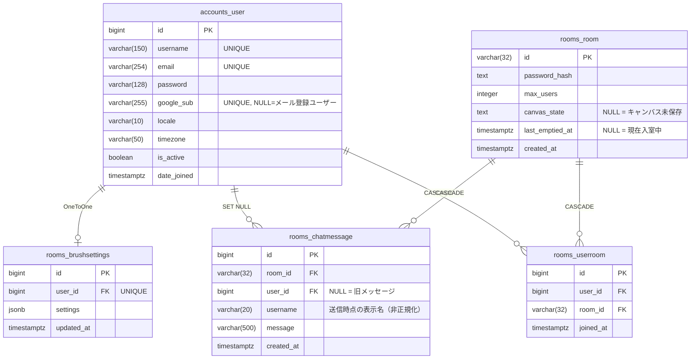

# DB 設計資料

お絵描きチャット Neo のデータベース設計ドキュメント。

- **RDBMS**: PostgreSQL 16
- **ORM**: Django ORM (Django 5.x)
- **文字コード**: UTF-8
- **タイムゾーン**: UTC（アプリ側で JST 変換）

---

## テーブル一覧

| テーブル名 | 説明 | Django モデル |
|-----------|------|--------------|
| [`accounts_user`](tables/accounts_user.md) | 認証ユーザー（メール or Google SSO） | `accounts.User` |
| [`rooms_room`](tables/rooms_room.md) | 描画ルーム | `rooms.Room` |
| [`rooms_brushsettings`](tables/rooms_brushsettings.md) | ユーザーごとのブラシ設定 | `rooms.BrushSettings` |
| [`rooms_chatmessage`](tables/rooms_chatmessage.md) | チャットメッセージ履歴 | `rooms.ChatMessage` |
| [`rooms_userroom`](tables/rooms_userroom.md) | ユーザーと部屋の参加履歴 | `rooms.UserRoom` |

Django 管理テーブル（`django_migrations`, `django_content_type`, `auth_*`, `account_*`）はアプリ固有ではないため省略。

---

## ER 図



---

## ライフサイクルとデータの流れ

```
POST /api/auth/login  または  /accounts/google/login/ (Google SSO)
  → セッション作成（accounts_user.last_login 更新）

POST /api/rooms
  → rooms_room 作成（last_emptied_at = now()）
  ※ ログイン必須

Socket connect
  → セッションCookieを検証し accounts_user を特定
  → 未認証ならコネクション拒否

Socket join_room
  → rooms_room.last_emptied_at = NULL（削除対象から外れる）
  → rooms_userroom を UPSERT（ダッシュボード表示用）
  → rooms_brushsettings を読み込んでクライアントへ返す
  → rooms_chatmessage 直近50件をクライアントへ返す

Socket draw_op / canvas_state
  → rooms_room.canvas_state を上書き保存（最新1件のみ保持）

Socket brush_settings
  → rooms_brushsettings を UPSERT（user_id がキー、部屋をまたいで保持）

Socket chat_message
  → rooms_chatmessage に INSERT（user_id FK + username 非正規化）

Socket disconnect（最後の1人が退出）
  → rooms_room.last_emptied_at = now()

バックグラウンドクリーンアップ（5分ごと）
  → last_emptied_at < now() - 30分 の rooms_room を DELETE（CASCADE）
  → rooms_userroom も CASCADE で削除
```

---

## マイグレーション履歴

### accounts アプリ

| # | ファイル | 内容 |
|---|---------|------|
| 0001 | `accounts/migrations/0001_initial.py` | `accounts_user` 作成 |

### rooms アプリ

| # | ファイル | 内容 |
|---|---------|------|
| 0001 | `rooms/migrations/0001_initial.py` | `rooms_room`, `rooms_brushsettings` 作成 |
| 0002 | `rooms/migrations/0002_alter_brushsettings_id.py` | `brushsettings.id` を `BigAutoField` に変更 |
| 0003 | `rooms/migrations/0003_chatmessage.py` | `rooms_chatmessage` 作成 |
| 0004 | `rooms/migrations/0004_brushsettings_global_per_user.py` | `brushsettings` の `room` FK 削除、`username` を UNIQUE キー化 |
| 0005 | `rooms/migrations/0005_auth_integration.py` | `brushsettings.username` → `user_id` FK、`chatmessage.user_id` VARCHAR削除 → FK追加、`rooms_userroom` 作成 |
