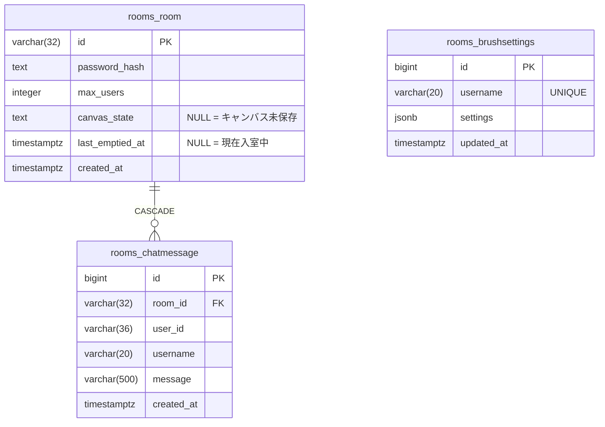

# DB 設計資料

お絵描きチャット Neo のデータベース設計ドキュメント。

- **RDBMS**: PostgreSQL 16
- **ORM**: Django ORM (Django 5.x)
- **文字コード**: UTF-8
- **タイムゾーン**: UTC（アプリ側で JST 変換）

---

## テーブル一覧

| テーブル名 | 説明 | Django モデル |
|-----------|------|--------------|
| [`rooms_room`](tables/rooms_room.md) | 描画ルーム | `rooms.Room` |
| [`rooms_brushsettings`](tables/rooms_brushsettings.md) | ユーザーごとのブラシ設定 | `rooms.BrushSettings` |
| [`rooms_chatmessage`](tables/rooms_chatmessage.md) | チャットメッセージ履歴 | `rooms.ChatMessage` |

Django 管理テーブル（`django_migrations`, `django_content_type`）はアプリ固有ではないため省略。

---

## ER 図



---

## ライフサイクルとデータの流れ

```
POST /api/rooms
  → rooms_room 作成（last_emptied_at = now()）

Socket join_room
  → rooms_room.last_emptied_at = NULL（削除対象から外れる）
  → rooms_brushsettings を読み込んでクライアントへ返す
  → rooms_chatmessage 直近50件をクライアントへ返す

Socket draw_op / canvas_state
  → rooms_room.canvas_state を上書き保存（最新1件のみ保持）

Socket brush_settings
  → rooms_brushsettings を UPSERT（username がキー、部屋をまたいで保持）

Socket chat_message
  → rooms_chatmessage に INSERT

Socket disconnect（最後の1人が退出）
  → rooms_room.last_emptied_at = now()

バックグラウンドクリーンアップ（5分ごと）
  → last_emptied_at < now() - 30分 の rooms_room を DELETE（CASCADE）
```

---

## マイグレーション履歴

| # | ファイル | 内容 |
|---|---------|------|
| 0001 | `rooms/migrations/0001_initial.py` | `rooms_room`, `rooms_brushsettings` 作成 |
| 0002 | `rooms/migrations/0002_alter_brushsettings_id.py` | `brushsettings.id` を `BigAutoField` に変更 |
| 0003 | `rooms/migrations/0003_chatmessage.py` | `rooms_chatmessage` 作成 |
| 0004 | `rooms/migrations/0004_brushsettings_global_per_user.py` | `brushsettings` の `room` FK 削除、`username` を UNIQUE キー化（ユーザーグローバル化） |
